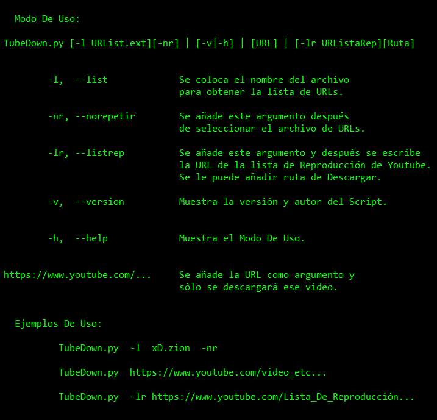

# TubeDown
## Descarga videos de YouTube con Python

- - -


## Modo De Uso:



- - -


 * ___Descargar videos de uno en uno:___
 
    - Solo se ejecuta el _Script_ ya sea directamente o desde consola.
        
        ```batch
        TubeDown.py
        ```
 * ___Descargar una lista de videos:___
 
    - Se ejecuta el _Script_ desde consola.
        
        ```batch
        TubeDown.py  -l  URList.txt
        ```
        
 * ___Descargar una lista de videos y no descargar los ya existentes:___
 
    - Se ejecuta el _Script_ desde consola.
        
        ```batch
        TubeDown.py  -l  URList.txt  -nr
        ```
        
 * ___Descargar sólo un video:___
 
    - Se ejecuta el _Script_ desde consola.
        
        ```batch
        TubeDown.py  https://www.youtube.com/video_etc...
        ```

        
 * ___Descargar una Lista de Reproducción de Youtube:___
 
    - Se ejecuta el _Script_ desde consola.
        
        ```batch
        TubeDown.py  -lr  https://www.youtube.com/Lista_De_reproducción...
        ```

                
 * ___Descargar una Lista de Reproducción de Youtube en una Carpeta Especifica:___
 
    - Se ejecuta el _Script_ desde consola.
        
        ```batch
        TubeDown.py  -lr  https://www.youtube.com/Lista_De_reproducción...  CarpetaDescargas
        ```


 * ___Ver el Modo de Uso:___
 
    - Se ejecuta el _Script_ desde consola.
        
        ```batch
        TubeDown.py  -h
        ```

        
 * ___Ver Versión y Autor del Script:___
 
    - Se ejecuta el _Script_ desde consola.
        
        ```batch
        TubeDown.py  -v
        ```

- - -

### Ejemplo De Uso:

```batch
Ejemplo 1 - Lista de URLs:          TubeDown.py  -l  xD.zion  -nr
                      
Ejemplo 2 - De a uno solo:          TubeDown.py  https://www.youtube.com/video_etc...

Ejemplo 3 - Lista de Reproducción de Youtube:

            TubeDown.py  -lr  http://www.youtube.com/Lista_De_Reproducción  CarpetaDescargas
```
